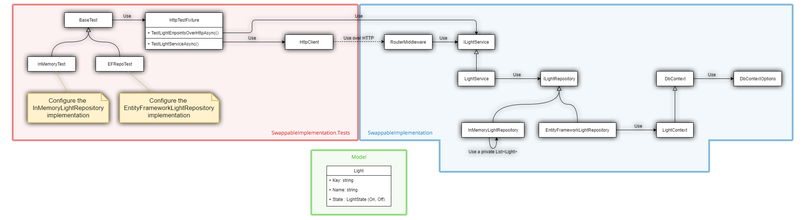

# Sample projects
This project aims at demonstrating the interchangeability between services implementation.
It has been built to demo the concept automatically, instead of creating a big manual procedure (it makes it easier to reproduce the use cases).

This project is not supposed to show best practices or anything.

> **Note**
>
> Usually, in tests, you want to test only one operation per test, not a sequence of events.
>
> In this case, this was my exact goal: a sequence of events.
> This keeps things simple and easy to follow.

## How it works
The domain is a light bulb called `Light`. You can name a light and turn it on or off. As simple as that.

### SwappableImplementation
The *SwappableImplementation* project contain an empty `Startup.ConfigureServices` method. 
The object graph is created in the tests and is different for both test classes.

I followed the patterns explained in my [Design Patterns: Asp.Net Core Web API, services, and repositories](http://todo.set.this.to.the.real.url) article series.
But, instead of using an MVC Controller, I used the Asp.Net Core Router. See `Startup.cs` for more info.

There are two repository implementations, one using Entity Framework Core and the other using a simple List&lt;Light&gt;.

*See the schema below for a visual representation of the project.*

### SwappableImplementation.Tests
The *SwappableImplementation.Tests* project contains the experiment, the automated use cases.

- The `HttpTestFixture` class implement most of the test code and is reused in other classes.
- The `BaseTest` class play the test definition role.
- Both `EFRepoTest` and `InMemoryTest` inherit from `BaseTest` and defines only the `ConfigureServices` method.

*See the schema below for a visual representation of the project.*

## Swapping at runtime
The short answer is: it is not possible to inject different implementation for different context at runtime while using only the default Asp.Net Core DI Container.

But, since Asp.Net Core is extensible, you can use an external DI Container to do so.
See [Introduction to Dependency Injection in ASP.NET Core - Replacing the default services container](https://docs.microsoft.com/en-us/aspnet/core/fundamentals/dependency-injection#replacing-the-default-services-container) for more info.

# Schema - objects' relations

